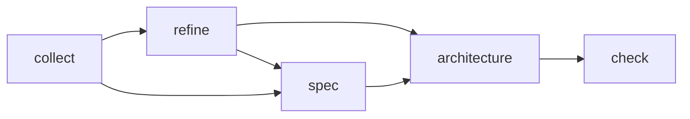
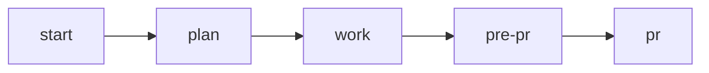

# OrçaSonhos Backend

API de gestão financeira que transforma sonhos em metas financeiras alcançáveis, com foco em orçamentos flexíveis, colaboração familiar e controle de gastos.

# META SPECS em: https://github.com/danilotandrade1518/orca-sonhos-meta-specs

## Sobre o Projeto

OrçaSonhos é uma plataforma de gestão financeira projetada para transformar sonhos pessoais em objetivos financeiros estruturados e alcançáveis.

### Funcionalidades Principais

- **Múltiplos Orçamentos**: Acompanhamento flexível de orçamentos em diferentes contextos financeiros
- **Metas SMART**: Definição de objetivos financeiros estruturados e mensuráveis
- **Colaboração Familiar**: Planejamento financeiro colaborativo simplificado
- **Offline-First**: Funcionalidade robusta mesmo sem conexão
- **Mobile-First**: Interface otimizada para dispositivos móveis

### Arquitetura

- **Backend**: Clean Architecture + Domain-Driven Design (DDD)
- **Autenticação**: Firebase
- **Princípios**: Offline-first, Mobile-first

**Status:** MVP em desenvolvimento

## Como rodar

```bash
# Instale as dependências
npm install

# Rode em modo desenvolvimento
npm run dev

# Com Docker
# (garante que o banco também suba)
docker-compose up --build
```

## Testes

```bash
# Testes unitários (arquivos .spec.ts)
npm run test:watch

# Testes integrados (arquivos .test.ts)
npm run test:integration

# Cobertura de testes
npm test:coverage
```

## Scripts úteis

- `npm run lint` — Lint do código
- `npm run format` — Formata o código com Prettier

## Contribuição

- Siga o padrão de código (ESLint/Prettier)
- Crie testes para novas funcionalidades
- Use variáveis de ambiente conforme `.env.example`

### Observabilidade (MVP)

Variáveis relevantes:

- `DB_SLOW_QUERY_MS` (default 200): limiar em ms acima do qual uma query é logada como lenta (`category":"db.slow_query"`). Abaixo disso é logada em nível debug (`category":"db.query"`).

Logs de mutações seguem par `mutation.start` / `mutation.end` com `durationMs` e `outcome`.

### Application Insights

Opcionalmente é possível habilitar o Azure Application Insights definindo as variáveis:

| Variável                          | Descrição                                                                                        |
| --------------------------------- | ------------------------------------------------------------------------------------------------ |
| `APPINSIGHTS_CONNECTION_STRING`   | Connection string do recurso Application Insights (quando ausente, a instrumentação é ignorada). |
| `APPINSIGHTS_ROLE_NAME`           | Nome lógico (cloud role) para filtrar no portal (default: `orca-sonhos-api`).                    |
| `APPINSIGHTS_SAMPLING_PERCENTAGE` | Percentual de amostragem (0-100). Quando não definido, usa default do SDK.                       |
| `APPINSIGHTS_DISABLED`            | Quando `true`, força desativação mesmo com connection string.                                    |

O SDK é inicializado de forma idempotente em `src/shared/observability/app-insights.ts` e chamado no bootstrap (`src/index.ts`). Console logs, requests, dependências (PostgreSQL) e exceções são coletados automaticamente. Live Metrics está desabilitado por padrão.

## COMMANDS

### Product

| Comando                                           | Descrição                                                          |
| ------------------------------------------------- | ------------------------------------------------------------------ |
| [/warm-up](.claude/commands/warm-up.md)           | Refresca a memória do agente sobre o que é o projeto               |
| [/check](.claude/commands/check.md)               | Checa se os requirements batem com as meta specs                   |
| [/collect](.claude/commands/collect.md)           | Coleta um novo requirement rapidamente, sem muita pergunta         |
| [/refine](.claude/commands/refine.md)             | Faz um refinamento básico no requirement (WHY/WHAT/HOW)            |
| [/spec](.claude/commands/spec.md)                 | Especifica o requirement em detalhes (deixe no seu formato de PRD) |
| [/architecture](.claude/commands/architecture.md) | Faz o desenho da arquitetura do projeto                            |

A ordem de execução deste fluxo é:



PS. Não é necessário sempre executar spec e depois refine. Você pode fazer apenas um deles e seguir de acordo com a complexidade do card. Uma outra prática interessante é fazer o refine dos cards o mais rápido possível para ter uma documentação boa e padronizada, mas deixar o spec para depois, quando for a hora de gastar mais tempo no card.

#### Configurando o Claude Desktop

Se você estiver usando o Claude Desktop, você pode criar um agente para servir como seu agente de produto. É recomando, uma vez que os times de produto não possuem muita experiência com VS Code.

Para isso, configure-o da seguinte maneira:

- Crie um projeto no Claude, exemplo: "Product Manager".
- Copie o prompt em [claude-desktop/prompt.md](claude-desktop/prompt.md) na área de instruções do projeto - faça ajustes necessários para o seu caso de uso
- Coloque todos os comandos de produto dentro do Claude como documentos para que o agente possa interpretar comandos normalmente.

Agora você pode usar o Claude Desktop para interagir com o seu agente de produto.

### Engineering

Os comandos são atalhos para prompts que são utilizados no nosso processo de desenvolvimento. O processo todo é composto da execução dos comandos na seguinte ordem:



#### [/start](.claude/commands/start.md)

Este comando inicia o processo de desenvolvimento em uma branch. Ele garante que estamos em uma branch, e cria uma pasta dentro de .claude/sessions com o mesmo nome da branch para armazenar seus documentos intermediários.

1. Chame o comando com o card ou com o caminho de um arquivo com os requirements (boa prática é criar um arquivo requirements.md na pasta sessions/<branch-name>)
2. AI vai ler os requirements e gerar uma lista de perguntas para clarificar o que deve ser feito. Responda as perguntas dando o direcionamento adequado.
3. AI vai gerar um arquivo context.md na pasta sessions/<branch-name> mostrando seu entendimento do card. Itere neste arquivo até estar correto.
4. AI vai gerar um arquivo architecture.md na pasta sessions/<branch-name> mostrando sua proposta de arquitetura. Itere neste arquivo até estar correto.

#### [/plan](.claude/commands/plan.md)

Este comando inicia o processo de planejamento de desenvolvimento em uma branch. Ele vai ler os documentos intermediários e criar um arquivo plan.md na pasta sessions/<branch-name> mostrando sua proposta de planejamento em etapas. O prompt pede que ele quebre em pedaços para ficar mais fácil fazer o gerenciamento das sessões.

#### [/work](.claude/commands/work.md)

Este comando inicia o processo de desenvolvimento em uma branch. Ele vai ler os documentos intermediários, encontrar o plano, identificar em qual etapa do plano está e começar a coda-la. Ele está instruído para pedir sua aprovação explicita antes de seguir (mude isso se quiser), recomendo deixar.

Boa prática: vá fazendo commits conforme cada phase é completada para poder voltar atrás caso aconteça algum problema.

#### [/pre-pr](.claude/commands/pre-pr.md)

Este comando inicia o processo de pré-PR em uma branch. Ele vai executar 4 agentes para garantir que nosso código está de acordo com o nosso objetivo:

1. `branch-metaspec-checker`.
2. `branch-code-reviewer`
3. `branch-documentation-writer`
4. `branch-test-planner`

#### [/pr](.claude/commands/pr.md)

Este comando inicia o processo de PR em uma branch. Configure-o para deixá-lo compatível com seu próprio fluxo de PR.

## FAQ

### Como eu forneço acesso as metaspecs para os agentes?

Você pode entregar seus metaspecs de várias maneiras:

- Passando o caminho local da sua maquina
- Passando o repositório diretamente
- Usando algum MCP como [Code Expert](https://github.com/lfnovo/code-expert-mcp) ou [RepoPrompt](https://repoprompt.com/).
- Usando algum MCP onde esteja a documentação como Notion, Confluence, etc.

Depois, basta informar ao agente onde encontrar os metaspecs.

- No caso do Claude Desktop, coloque no prompt de instruções
- No caso do Claude Code, coloque no arquivo CLAUDE.md do usuário ou do repositório

### Como eu forneço acesso ao codebase para os agentes consultarem?

Você pode oferecer acesso ao codebase de 3 maneiras:

- Passando o caminho local da sua maquina
- Passando o repositório diretamente
- Usando algum MCP como [Code Expert](https://github.com/lfnovo/code-expert-mcp) ou [RepoPrompt](https://repoprompt.com/).

Depois, basta informar ao agente onde encontrar o código.

- No caso do Claude Desktop, coloque no prompt de instruções
- No caso do Claude Code, coloque no arquivo CLAUDE.md do usuário ou do repositório

Claude Code já tem acesso ao repositório local, obviamente. Este passo é apenas para quando ele precisa acessar outros repos do projeto.
